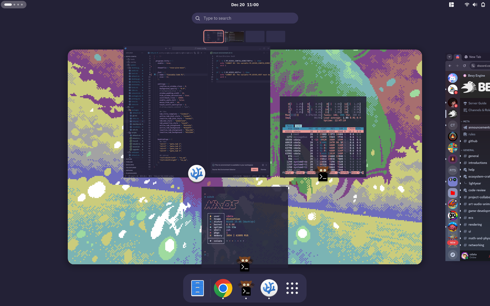

```


                       ,
                      /|
                     /*|         
       . ~ ☀        /.+|      🜂
       ( + )        /* .|
      ☽  ~ '       |:+.:\         
                   /+.:*.\     🜁
                  |:.*.:+|      
                 /+.---.Z\      
               ,(((/o^o\))\     🜄
              (())) ' > ()))       
              )(())(/~\))))(
             /((()'`))((()(\)      🜃
            /::)).&& (()))():\
           /:*::)'||.   /\+:::\
          /:::::( || \ / |:/:::)
          \:::+/-'L|, &  |::*:/
           |::(|_  _'   _\+::|
           |*::\ `-'   //,):/\
           |:::+| ||   
---------------------,
       ♣      ♦     /     ~ U T  S U P R A ~
  ♥        ♠      /   ~ S I C  I N F R A ~
                / 
```

# System operations

## Bootstrapping

1. [Install NixOS from media of your choice][NixOS Download]
2. Ensure that you have the `git` package installed (it is not installed by default)
3. Run the [bootstrap script] and answer the prompts

Note: after running the [bootstrap script], the source tree of this repository will be checked out in `$HOME/Git/github.com/cdata/nixos-config`.

## Modifying

1. Make desired changes to the source tree
2. Run `rebuild-nix` from the command line

## Upgrading

Run `upgrade-nix` from the command line

# Errata

## Layout

- [`/hosts`]: Hardware-specific configurations; each computer that I am running NixOS on is represented here
- [`/system`]: Base operating system configuration, a baseline for services, peripherals and desktop environmnet
- [`/user`]: User-space configurations, configured via [Home Manager]; dotfiles, packages, scripts, wallpaper, etc.
- [`/overlay`]: Local (to this source tree) Nix packages that are available as an overlay to the upstream package space
- [`/screenshots`]: Self-indulgent screenshots of the system aesthetic

## Scripts

- [`/bootstrap.sh`][bootstrap script]: One-time setup script to bootstrap from a fresh NixOS install
- [`ensure-environment`]: Asserts that expected evironment variables used by other scripts have been set
- [`rebuild-nix`]: Rebuilds the system
- [`upgrade-nix`]: Updates all sources and rebuilds the system
- [`record`]: Produces high-quality screen recording via `ffmpeg`
- [`mux`]: Mixes an audio and video track together

## Forking

This source tree will require some modification if it is forked by persons other
than me. Here is a partial (not-comprehensive) list of things that may need to
be tweaked (and perhaps ought to be made parameterizable):

- [Public key needs to be changed](./public_key.txt)
- [Bootstrap script Git repository references][bootstrap script]
- [Git configuration](./modules/user/packages/git.nix)
- [Entries under the `hosts` folder](./hosts)
- [Username and host options in flake.nix](./flake.nix)

## Lookbook



[NixOS Download]: https://nixos.org/download/
[bootstrap script]: ./bootstrap.sh
[`ensure-environment`]: ./user/scripts/ensure-environment.sh
[`upgrade-nix`]: ./user/scripts/upgrade-nix.sh
[`rebuild-nix`]: ./user/scripts/rebuild-nix.sh
[`record`]: ./user/scripts/rebuild-nix.sh
[`mux`]: ./user/scripts/mux.sh
[`/hosts`]: ./hosts
[`/system`]: ./system
[`/user`]: ./user
[`/overlay`]: ./overlay
[`/screenshots`]: ./screenshots
[Home Manager]: https://nix-community.github.io/home-manager/ 
